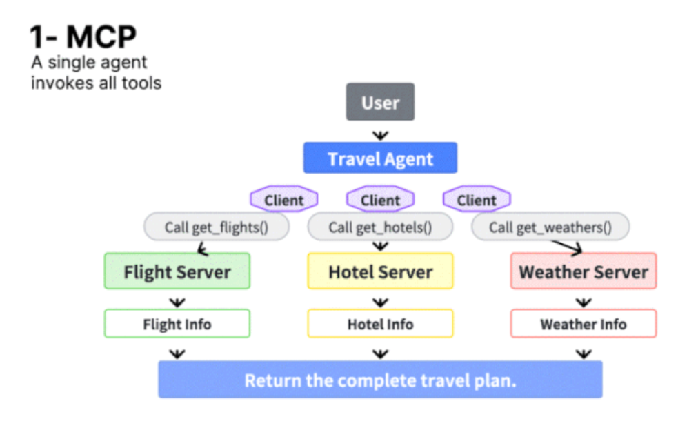
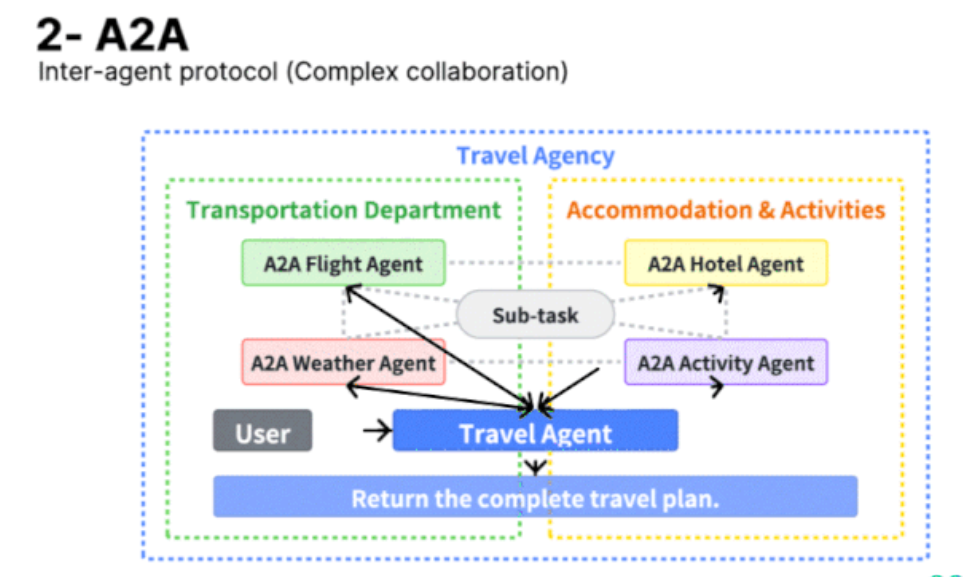
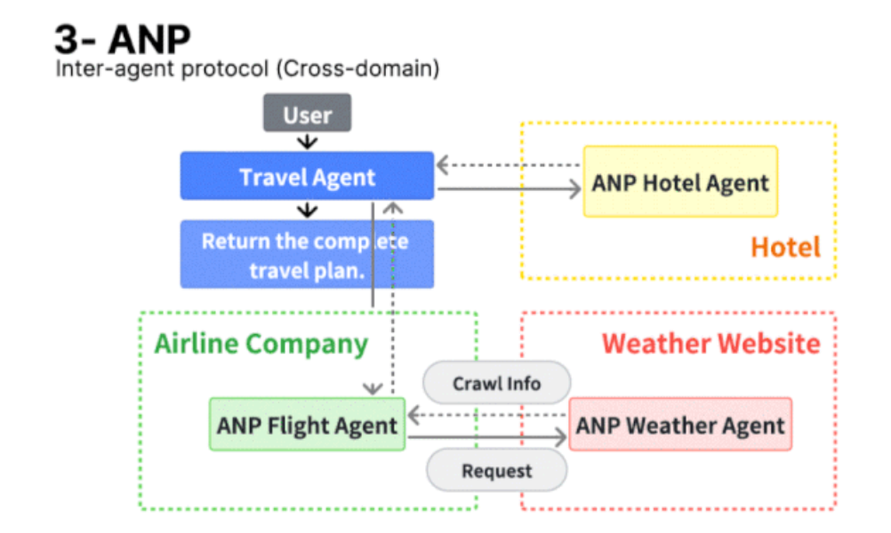
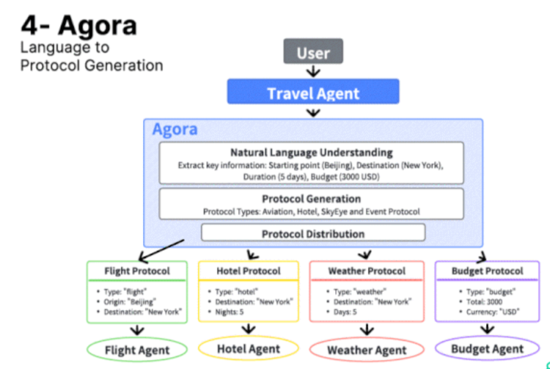

* 1 Command, 4 Protocols - Which One Got What Right?

* This research paper gave one simple instruction to four different agent frameworks: 
  1. “Plan a 5-day trip from Beijing to New York.”

* Here’s the summary:

* MCP - Monolithic Control Protocol
  1. One agent calls all APIs (flights, hotels, weather) directly.
  1. ✅Fastest when tasks are simple and predictable.
  1. ❌Breaks quickly with complexity. No adaptability or fault tolerance.
  1. 

* A2A - Agent-to-Agent Protocol
  1. Travel agent delegates to specialized sub-agents.
  1. ✅Modular, scalable, and robust. Great for multitasking and system evolution.
  1. ❌Needs orchestration. A solid design pattern for long-term growth.
  2. 

* ANP - Cross-Domain Agent Protocol
  1. Agents interact with real-world systems (airline APIs, weather sites).
  1. ✅Rich, realistic results that reflect live data.
  1. ❌Latency & fragility due to dependence on external services.
  2. 2. 

* Agora - Language-to-Protocol Generation
  1. Understands natural language, converts it into structured agent protocols.
  1. ✅Most flexible & future-proof. Handles vague, human-like requests with ease.
  1. ❌Slower upfront: NLU + protocol generation takes work, but scales beautifully.
  2. 2. 

* The bottom-line:
  1. Speed isn’t everything. Robustness, adaptability, and modularity really matter when agent systems scale.
  2. Agora and A2A are better suited for dynamic, real-world applications where requests are messy and context-heavy.
  3. MCP is more suited for internal tasks.
 
  
